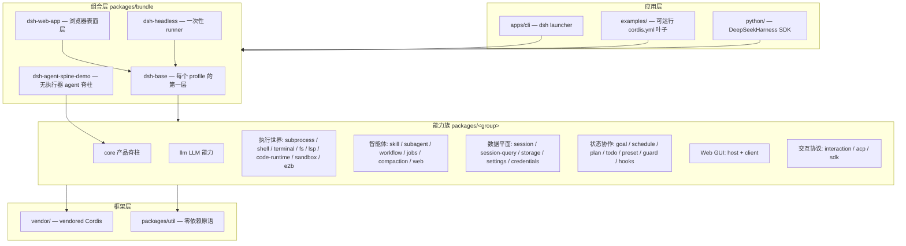
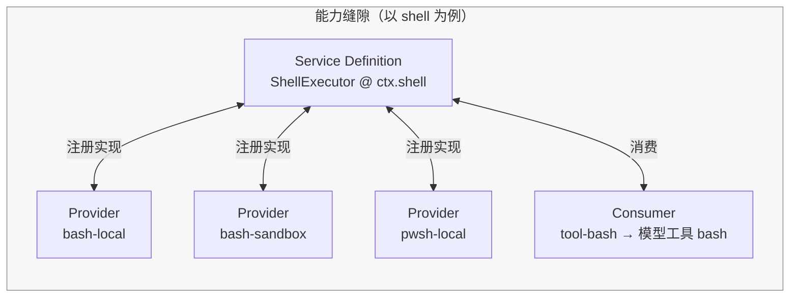
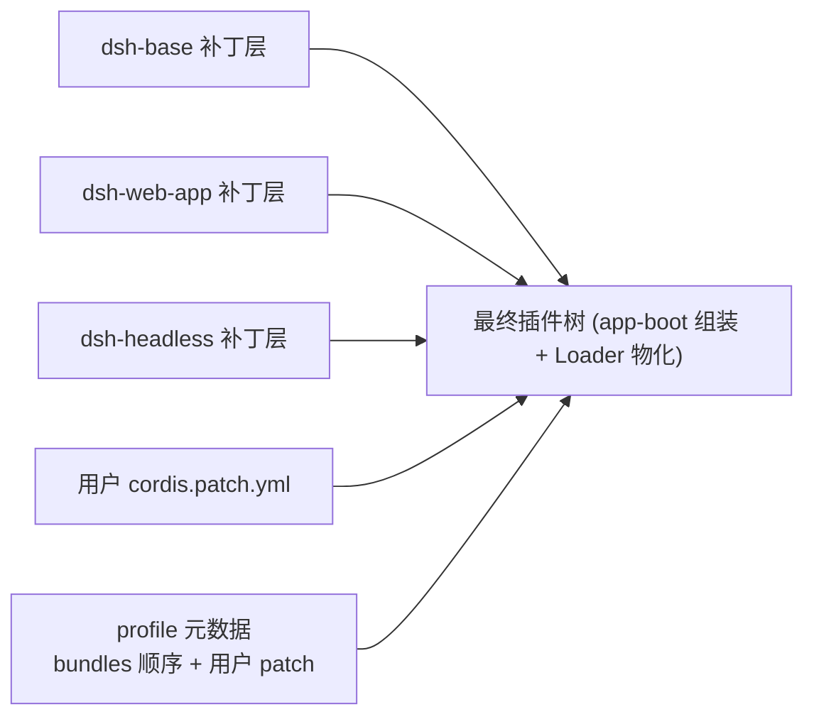
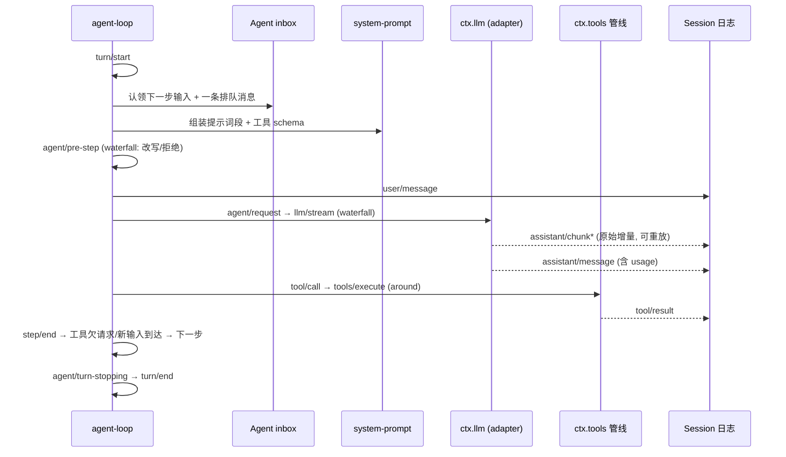
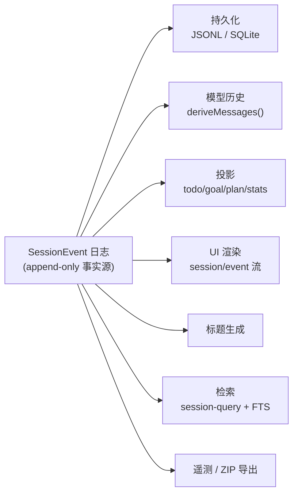
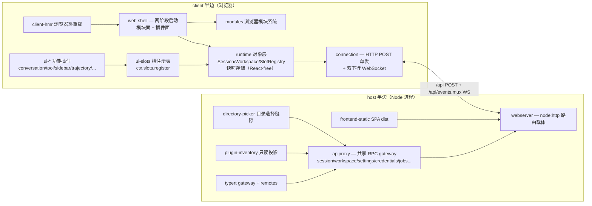
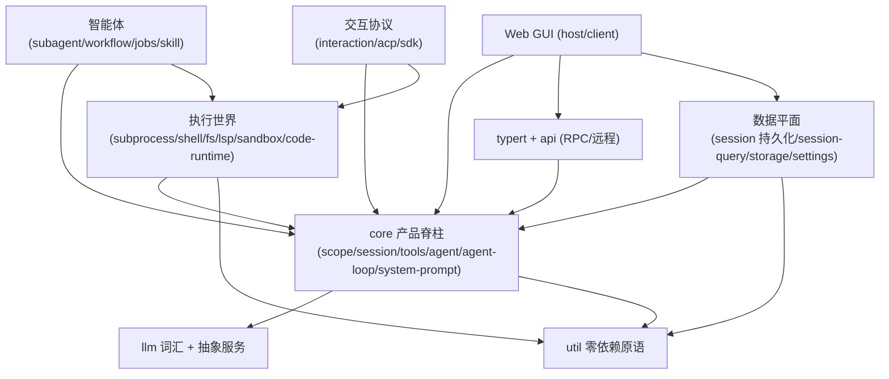

# DeepSeek Harness 工程分析

> 本文是对 `deepseek-harness` 仓库（dsh）的功能实现分析：从整体架构、运行机制到 54 个包组的功能说明，并配以图表。
> 基于仓库当前源码与文档（docs/architecture.md、packages/README.md、各包 README、docs/module-graph.md）整理。

## 1. 项目总览

DeepSeek Harness（`dsh`）是 DeepSeek AI 开源的 **agent harness**：一个运行在 vendored [Cordis](https://github.com/cordiverse/cordis) 插件框架之上的 TypeScript agent 运行时。它把「模型适配、工具注册、会话日志、agent 循环、Web GUI」全部做成可替换的 Cordis 插件——**everything is a plugin** 是字面事实：没有需要打补丁的特权核心，扩展 dsh 就是在插件旁边再挂一个插件。

- **技术栈**：TypeScript（全仓 ESM，`strict: true`）、pnpm workspaces、Node `^22.19 || >=24`；浏览器端是 React（非 Vue）插件体系。
- **状态**：`0.1.0-rc` 开发者预览版；采用「foundation over blast radius」预发布姿态——允许自由重命名/重构，后端拒绝旧磁盘格式，会话格式版本 `SESSION_FORMAT_VERSION = 0`，SQLite 单调 `SCHEMA_VERSION`。
- **三种运行形态**：`dsh web`（带 Web GUI 的交互 agent）、`dsh headless`（一次性任务）、ACP/JSON-RPC/Python SDK 驱动的无人值守形态。

### 仓库布局

```
vendor/      vendored Cordis 源码（rescope 为 @deepseek-ai/*，18 条本地修改有日志）
packages/    @deepseek-ai/dsh-<pkg> 工作区（54 个包组，按 group/pkg 两级组织）
  core/        产品 API 脊柱：session / agent / agent-loop / tools / system-prompt / scope
  llm/         LLM 能力：抽象服务 + DeepSeek/pi-ai 适配器 + 重试 + token 计量
  api/         Remote BFF 组装 + Typert RPC gateway
  typert/      类型图生成、加载器、运行时注册表
  mcp/         MCP 客户端桥
  ...          执行世界、智能体、数据平面、Web GUI 等能力族（见第 4 节）
apps/        cli（dsh launcher）+ web（前端构建入口）
examples/    可运行的 cordis.yml 叶子（headless-agent / acp-agent / jsonrpc-agent / mcp-memory ...）
python/      Python SDK + 打包的 runtime 二进制
native/      @deepseek-ai/node-addon-landlock-run（Landlock 自限制 launcher，C11 静态链接）
scripts/     仓库 gates 与生成器（run-gates.ts 调度 14 种 CI 模式）
docs/        分层文档体系（architecture / subsystems / cookbook / postmortem / ...）
website/     VitePress 站点投影（不含正典内容，投影自 docs/）
.agents/     Agent Notes（决策记录，implemented ~1515 篇）+ 11 个 agent skills
```

### 分层架构总览



## 2. 核心架构理念

### 2.1 一切皆插件，注册即效果

Cordis 的 `Context` 是依赖容器：插件经 `ctx.plugin()` 启动得到 `Fiber` 生命周期单元；**所有注册都通过 `ctx.effect()` / `ctx.on()` 完成，disposer 随 fiber 卸载自动回滚**。服务包 default-export 服务类（`super(ctx, name)` 即注册），函数插件 named-export `name / inject / Config / apply`。

### 2.2 能力缝隙（Capability Seam）三件套

可替换能力的标准形态是**三个角色**：Service Definition（声明接口的抽象服务，如 `ctx.shell`）→ Service Provider（具体实现插件，可多个并存/替换）→ Consumer（消费方，通常是对模型的工具）。一个能力完整包含三件套；切换 provider 即可换掉整个产品行为——例如把 `ctx.fs`/`ctx.subprocess` 挂上 E2B 适配器，bash/PTY/LSP 无需任何分支就整体搬进远程沙箱。



### 2.3 事件驱动：typed events + waterfall

- **Typed events 声明合并**：`SessionEventMap` 等 map 是 merge-extensible 的，任何包都可向会话事件词汇追加自己的事件类型。
- **五种调度模式**：`emit`（同步观察）/ `parallel` / `serial` / `bail` / `waterfall`。waterfall 是 around-middleware：监听器必须调用 `next()` 才委托，不调即短路；`agent/pre-step`、`agent/request`、`llm/stream`、`tools/*` 都是 waterfall——拦截、改写、拒绝一切请求的官方扩展点。
- **模型可见 ⟺ 已记日志**：任何到达模型请求的输入都必须是可回放的会话日志事件，运行时 invariant 强制此关系；新增模型可见输入 = 新增 SessionEvent。

### 2.4 横切约定

| 约定 | 含义 |
|---|---|
| 跨边界 ID 品牌化 | `Branded<B>`（SessionId / CallId / JobId / FsTargetKey...），不裸用 string |
| 显式 > 隐式 | 默认化是 `resolve(request): Spec` 显式步骤，绝无隐藏的 `?? default` |
| 误配置 loud fail | 加载期可判定即失败，绝不静默跳过缺失引用 |
| 可移植性 | 能力缝隙支持同一执行世界跨 provider 搬运（本地 ↔ E2B 沙箱） |
| 运行时不变量 | 每个包拥有 `./invariant` 伴生，检查权威数据关系（`ctx.invariants`） |
| 测试门禁 | CI 覆盖率按文件 100%（`test:coverage`）；关键行为变更须带 keyless 快照测试 |

## 3. 运行机制

### 3.1 组合：profile × bundle × patch

一次 `dsh` 运行 = 一棵按序分层组合出来的插件树：

1. **profile**（`$DSH_HOME/profiles/<name>/`）：声明堆叠哪些 bundle、持有用户 `cordis.patch.yml`；`web` / `headless` 为内置模板。
2. **bundle**（`packages/bundle/*`）：`package.json` 的 `dsh.bundle.patch` 指向 `cordis.patch.yml`，是可安装的补丁层。`dsh-base` 是每个 profile 的第一层（模型适配器、工具、持久化、沙箱与审批策略、settings/credentials/telemetry、typert 三件套）；`dsh-web-app` 加浏览器应用；`dsh-headless` 加一次性 runner。
3. **patch 层序**：profile 内 bundle 按序 → profile 的 `cordis.patch.yml` → home 层 → `--patch` overlay。patch 按行 id 整行替换配置（不深合并）。
4. **启动**：`app-boot.boot()` 建根 context → 装 Loader（`cordis:include`/`cordis:group`）→ 挂 include 树 → 断言条目激活；`cmdline` 把 launcher 参数交给 app 插件的 `webStartup`/`headlessStartup` provider；`dsh --profile web --dump-config` 可查看将启动的完整配置树。



### 3.2 核心循环：step 与 turn

**step** = 一次模型请求 + 它调用的工具；**turn** = 零到多个 step（从认领首个输入开始，到无欠账关闭）。输入统一走 agent 的 inbox，`inject` 注入的上下文等待下一条消息唤醒。



会话日志是所有下游的单一事实源：`deriveMessages()` 从日志投影模型历史；fork/resume/标题/遥测/检索/UI 渲染全部派生自同一事件流。

### 3.3 持久化与投影

- 事件追加进 `Session`（内存 store），`session-persistence` 缝隙负责落盘：JSONL（`.jsonl.zstd`，独立 Zstandard frame 拼接、chunk 打包压缩 ~60%）或 SQLite（`node:sqlite`，事件 1:1 表行）；`session-checkpoint-policy` 在 `llm/stream` 前、`tools/execute` 前、`agent/pre-step` 前做语义 checkpoint。
- 崩溃尾部修复会合成 `tool/result`/`step/end`/`turn/end {interrupted}` 闭合器，日志永远可重放。
- **投影**（`session-projection`）：订阅一次 `session/event`，逐事件驱动全部纯函数投影单元（todo/goal/plan/stats），`session-projection-cache` 按 `turn/end` checkpoint 持久化，UI 经 `SessionProjectionMap` 链（host → wire → React）消费。

## 4. 模块功能说明

### 4.1 core —— 产品 API 脊柱

| 子包 | ctx key | 功能 |
|---|---|---|
| `scope` | —（库） | 作用域注册原语：为每个 agent 铸造带标签 context；注册视图向下继承（agent→preset→global），scoped 事件准入向上扩展；`ScopedLayers` 提供层叠注册 |
| `session` | `ctx.sessions` | 事件溯源：append-only `SessionEvent` 日志 + 内存 store；`SessionStore`（create/prepare/enter/fork/...）、`deriveMessages()` 增量投影模型历史、surface 机制（compaction 重写时 `replaceGeneration`）、崩溃修复 |
| `system-prompt` | `ctx.systemPrompt` | 提示词组装注册表：有序 `section` / 动态 `context` / 工具 schema / `{{variable}}` 插值；`system-prompt/assemble` waterfall 是权威组装点；`complete:true` section 独占 |
| `tools` | `ctx.tools` | 工具注册表 + 守卫执行管线：`tools/pre-execute`（allow/deny/ask 门）→ guards → `tools/execute`（around）→ `tools/post-execute` → `tools/result`；`presentAs` 呈现模式、并发安全分类（排他屏障/并行池）、Code Mode（`run_code`） |
| `agent` | `ctx.agents` | `Agent` 接口 + 注册表 + `agent/*` 事件词汇（pre-step/request/request-error/turn-stopping/...全部 waterfall 或 serial）+ initiator 作用域（AsyncLocalStorage 因果归属）；零 loop 依赖，UI/hooks/编排器只对 `Agent` 句柄编程 |
| `agent-loop` | `ctx.agentLoop` | 唯一具体 loop 驱动：实现 `AgentFactory` 供 `ctx.agents.create()/resume()`；`ReactLoopAgent` 统一 `send()` 原语按 (target × wakeup) 路由；每成功调用恰好一个 `assistant/message` 锚点 |
| `agent-default-model` | `ctx.agentDefaultModel` | 入口点（headless/ApiProxy）无本地选择时的部署默认模型；保存经 settings 层 |
| `agent-tool-presentation` | — | agent preset 携带的一行声明：模型看到 native / code / both 哪种工具形态 |

### 4.2 llm —— LLM 能力族

| 子包 | ctx key | 功能 |
|---|---|---|
| `llm` | `ctx.llm` | provider 中立词汇 + 抽象服务：Message/ContentBlock/StreamChunk 协议（`block-start/text-delta/tool-call-delta/finish`，唯一终止 finish）、`LlmAdapter` 基类、`registerAdapter`（全或无原子注册）、`prepareCall()`（一次性绑定调用）、`stream()` 走 `llm/stream` waterfall；`HarnessError` 错误族、重试策略解析 |
| `llm-deepseek` | — | DeepSeek 官方 chat-completions 直连 adapter（裸 fetch + SSE）；每次请求重读配置 thunk；reasoning 回传、cache 记账、`thinking/reasoningEffort/maxTokens` 配置；唯一 `deepseek-official` provider 路由 |
| `llm-pi-ai` | — | 基于 `@earendil-works/pi-ai` 的通用多 provider adapter：按路由键控 profile 字典（OpenAI 兼容网关/自托管 = 配置而非代码）、已装目录继承+覆盖、`modelOverrides` 逐模型整形 |
| `llm-retry` | — | 函数插件：经 `agent/request-error` waterfall 执行 exact-provider 重试策略；每次重试开新编号 turn；normal 有限预算 / always 无限重试 |
| `token-meter` | `ctx.tokenMeter` | 可重放 token 测量：从持久日志推进的会话独立 fold；压力/定价 surface 快照；可选挂 `sessionProjections`（tokenUsage/contextPressure/contextBreakdown） |

### 4.3 api + typert + mcp —— 远程调用与类型图

| 子包 | ctx key | 功能 |
|---|---|---|
| `api/gateway` | `ctx.typertGateway` / `ctx.remote` | Host/Client 双端 Typert unary RPC 端点：descriptor + Cordis Service → 校验参数 → lookup 解析 → 调方法 → 校验结果；strict 模式读生成 descriptor，SRC 模式为开发兜底；17 种错误分类 |
| `api/remotes` | 配置 `ctx.typert` | Host Remote 双面 BFF：live Agent 复用/冷会话恢复/并发 resume 去重/subagent 所有权栅栏的同一身份策略；`API_REMOTE_FORWARDED_EVENTS` 是转发 Host 事件的唯一白名单 |
| `typert/protocol` | — | 编译器无关协议声明：`@Remote`/`@RemoteScope` 装饰器、`InvocationDescriptor`、merge-extensible 的 Lookup/Context/Remote map |
| `typert/generator` | — | 构建期 TS 工程分析器（3113 行 analyzer）+ 模型驱动生成器：源类型树 → 编译器无关 `TypeGraph` → 任意 artifact（Zod schema + 声明文件）；产出 `lib/typert.host.*` / `typert.client.*`；check 模式诊断失败即失败 |
| `typert/registry` | `ctx.typert` | 生成工件的运行时注册表：package face 反射 + live Zod schema 原子注册、endpoint 唯一性/撤回历史、lookup 双所有者（业务声明 + Host 组合 resolver） |
| `typert/loader` | — | Node-only Loader 集成：扫描 `./typert` export，字段级校验 manifest 后注册贡献，插件卸载即撤回；坏 artifact fail loud |
| `mcp/mcp-client` | — | MCP 客户端桥：stdio / streamable-http 传输，把外部 MCP server 工具注册进 `ctx.tools`（`mcp__<serverName>__<rawName>` 命名、64 字符归一化 + 哈希消歧、重连循环与 tool 重同步） |

### 4.4 执行世界 —— subprocess / shell / terminal / fs / lsp / code-runtime / sandbox / e2b

| 子包 | ctx key | 功能 |
|---|---|---|
| `subprocess` | `ctx.subprocess` | 进程基座：可执行查找（scrubbed PATH）、受管子进程树（stdin 预置数据、bounded 收集 + spill 文件）、PTY 终端原语、树级 SIGTERM→grace→SIGKILL 终止、`scrubbedParentEnv` 剔除凭据形/`DSH_*` 环境变量 |
| `shell` | `ctx.shell` | bash 能力缝隙：`resolve(request): Spec`（显式默认化）+ `run`（前台）/ `start`（后台）；providers 有 bash-local/bash-sandbox/pwsh-local/pwsh-sandbox；`shell-env` 提供受信 `DSH_*` 环境注册表；模型工具 `bash`/`pwsh`（+ 基于 PTY 的持久 `bash`） |
| `terminal` | `ctx.terminals` | 持久 PTY 会话：owner 精确归属（FOREIGN_SESSION 拒绝）、backend 注册表；`terminal-bash` 提供受控提示符就绪检测；六工具 `terminal_open/send/read/signal/close/list`，`terminal_send` 支持 `run_in_background` |
| `fs` | `ctx.fs` | 文件系统缝隙：品牌化 `FsTarget`、bounded 文本 IO、版本守卫的原子写/编辑、`fs/write-intent`/`fs/edit-intent`/`fs/observed` 事件门；本地/沙箱/E2B 实现；`fs-observation-policy` 挂 read-before-edit 策略；模型工具 `read`/`read_image`/`write`/`edit`/`glob`/`grep`（ripgrep 子进程）/`str_replace_editor` |
| `lsp` | `ctx.lsp` | 语言服务器导航缝隙：恰好四个语义操作（goToDefinition/findReferences/goToImplementation/hover），无通用 JSON-RPC 逃生舱；`lsp-stdio` 每次查询瞬态打开文档；模型工具 `lsp` |
| `code-runtime` | `ctx.codeRuntime` | 执行模型编写程序：worker 线程每 run 全新隔离（type-strip、空环境、computeMs+maxWallMs 双预算、64MiB 输出上限）；Code Mode 的 `run_code` 承载（工具注册 + TS/Python SDK 生成在 `core/tools`） |
| `sandbox` | `ctx.sandbox` | 进程限制缝隙：`confine(policy, argv, cwd)` 返回 enforcement/denialSignatures；Linux bwrap+Landlock 链、macOS Seatbelt、Windows ACL（受限 token + 每 workspace 写 SID）；`sandbox-policy` 是唯一策略源（`ctx.sandboxPolicy`，per-session 解析 + 升级词表）；升级编排经 `approveEscalation` 走审批通道 |
| `e2b` | `ctx.e2b` | 远程沙箱 POC：E2BRuntime 拥有沙箱生命周期；`fs-e2b`/`subprocess-e2b` 挂上两个适配器后，bash/terminal/lsp 零改动进入远端执行世界 |

### 4.5 智能体能力族 —— skill / subagent / workflow / jobs / compaction / web

| 子包 | ctx key | 功能 |
|---|---|---|
| `skill` | `ctx.skills` | skill 注册表 + 本地目录 provider（project/custom/user 四级发现、frontmatter 解析、文件监视）+ 内置 badge skill；`skill` loader 工具 + durable catalog 发布 |
| `subagent` | `ctx.subagents` | 子 agent 委托缝隙：多命名 provider 共存（同 context）；`spawn`（全新子 agent）/`fork`（父日志前缀播种）/ACP 外部进程/Codex/Claude Code/dsh-sdk（完整独立运行时）；`subagent` 工具（可后台）、`send_message`/`interrupt_agent` 控制工具、子作用域 `report` 通道 |
| `workflow` | `ctx.workflowEngine` | 模型编写的编排脚本（worker thread + 可逃逸 vm，API 塑形非安全边界）：`agent()/parallel()/pipeline()/phase()/log()` 钩子；`workflow` 通用工具 + `ralph` 固定 fresh-agent 循环工具；并发/总 agent 数上限防 runaway |
| `jobs` | `ctx.jobs` | 后台 job 协议：owner 隔离（`<kind>-N` 品牌 id）、first-wins 结算、增量读取、取消/等待/完成通知（可能同步开模型轮次）；`job_output`/`job_list`/`job_kill` 工具；bash/terminal/subagent 后台统一汇入 |
| `compaction` | `ctx.compaction` | 历史压缩缝隙：`compaction/start→summary→end` 持锁事件、`compaction-basic`（token 压力触发 + LLM 摘要 + 并发锁）、tool-result pruner（无模型截断历史工具结果）；`/compact` 命令显式触发 |
| `web` | `ctx.web` | web 搜索/抓取缝隙：provider 选择服务（search 与 fetch 共享）；Exa/Perplexity/DeepSeek 搜索 + HTTP fetch（凭据形重定向拒绝为家族规则）；模型工具 `web_search`/`web_fetch` |

### 4.6 会话数据平面 —— session / session-query / storage / settings / credentials / identity

| 子包 | ctx key | 功能 |
|---|---|---|
| `session-persistence` | `ctx.sessionPersistence` | 持久化缝隙：locate/create/append/prepare/load/inspect/readFrom/list；`PersistenceCoordinator` 有界批量窗口（默认 200ms）、崩溃修复、会话收养、静默销毁 |
| `session-persistence-jsonl` / `-sqlite` | 注册后端 | JSONL：每会话 `.jsonl.zstd`、chunk 打包压缩、POSIX 硬链接无覆盖发布；SQLite：事件 1:1 表行 + WAL + `application_id` 格式标识 |
| `session-checkpoint-policy` | — | 语义 checkpoint：llm/stream 前、tools/execute 前、agent/pre-step 前落盘；fail-closed |
| `session-projection` / `-cache` | `ctx.sessionProjections` / `ctx.sessionProjectionCache` | 投影驱动注册表（纯函数单元，whole-value 事件、同引用不通知）；checkpoint 持久化（turn/end 写点、读阶梯：缓存→restoreFloor→readFrom） |
| `session-stats` | 投影单元 | 全日志会话统计（`sessionStats`） |
| `session-title` / `-first-prompt-llm` / `-all-prompts-llm` | `ctx.sessionTitle` | 标题：确定性回退 + 至多一个异步 provider（首条消息定标题/全消息定标题两种 cadence）；log-only `session/title` 事件 |
| `session-telemetry` / `-otel` | `sessionTelemetry` | 遥测：非阻塞 enqueue 后端契约、`sessionTelemetry/record` 脱敏瀑布、chunk 只发每 (turn,step) 首块、at-most-once 交接；sharing 默认 DISABLED 显式 opt-in |
| `session-query` | `ctx.sessionQuery` | 检索缝隙：listSessions/readSession/filterSessions/filterEvents（闭式过滤器）/listEvents（current/shadowed/log-only 三分类）/traceSession（祖先+后代树）/traceEvent（positional 替换链）+ 仅两个抽象搜索方法 |
| `session-query-sqlite` | 注册引擎 | SQLite FTS5 unicode61 全文索引：live 行 TEMP 表 + 持久 derived 库、修订对比增量 reconcile、字面短语查询、`openAt: startup|first-search|never` |
| `tool-session-query` | — | 模型工具：`session_search`/`session_event_search`/`session_trace`/`session_event_trace`/`session_event_read`；跨会话访问要求 cwd 精确相等（opt-in） |
| `session-log-export` | `ctx.sessionLogDownload` | Web `/export`：Host ZIP 流式端点（fflate 压缩、64KiB 背压）+ 浏览器下载模态；includeDescendants 选项 |
| `storage` / `storage-json` / `storage-sqlite` | `ctx.storage` | 非会话存储 hub：命名后端注册 + merge-extensible `StorageForms`（kv facet → `KvUnit`）；JSON 全量原子重写 / SQLite STRICT 表 |
| `storage-domain` | `ctx.storageDomain` | 校验域记录存储：zod schema → 权威内存态，写先达后端再 emit `domain/changed`；消费者如 message-feedback、projection-cache |
| `settings` / `settings-file` | `ctx.settings` | 用户设置缝隙：注册 namespace + schema → `SettingsScope{get/watch/update}`；分层解析（schema 默认 → base → 用户文档）；乐观并发 revision、secret 角色脱敏；YAML provider 带跨进程锁 + leaf-level diff 保注释 |
| `credentials` / `credentials-local` | `ctx.credentials` | 凭据引用缝隙：配置只持引用（`apiKeyEnv`）、`resolve()` 每操作解析、空值=未配置；四层优先级 env > `$DSH_HOME/.credentials.yaml` > 项目 `.env` > user `.env`；0600 文件 + 权限位校验 |
| `identity` | —（库） | 匿名身份：harness-home 作用域随机 UUID v4，用于 OTel `user.id`/feedback/请求头关联 |
| `workspace` | — | workspace 实体 |



### 4.7 状态与协作 —— goal / schedule / feedback / plan / todo / preset / guard / extensions / hooks / context / attachment / spill

| 子包 | ctx key | 功能 |
|---|---|---|
| `goal` / `goal-round-driver` / `tool-goal` / `command-goal` | `ctx.goals` | 同会话目标状态机（create/edit/pause/resume/complete/block/clear，revisioned CAS + 回放校验）；idle 期续跑驱动（roundsStarted 预留 + 容量检查）；`get_goal`/`create_goal`/`update_goal` 工具 + `/goal` 命令；arming 永不持久化 |
| `schedule` | — | 会话本地定时提醒：`schedule/change` 事件（create/delete/dispatch）、`after_seconds`/绝对 `at`/`every_seconds`；`schedule_create/list/delete` 工具注册在精确 agent.ctx；投递经 `runMaintenance()` 空闲阶段、只补最新一次逾期 |
| `feedback` | `ctx.messageFeedback` | 两条契约：命令反馈（log-only `feedback/record` + `/feedback` 命令）与逐消息反馈（storage-domain sidecar、CAS、写前持久性屏障——durable feedback 永不先于 durable 目标消息） |
| `plan-mode` | `ctx.planMode` | plan 协作状态：log-only `plan/mode` 事件、`/plan [message]`/`/plan off` 命令、`exit_plan_mode` 工具需精确用户批准（plan-review 意图） |
| `tool-todo` | — | `todo_write` 整表替换工具：完整快照事件回放、投影单元、`allowParallelInProgress` 部署必填 |
| `agent-presets` / `persona` | `ctx.agentPresets` | 每会话 agent 组合：`agent.cordis.yml` 挂到 agent scope 下（工具/prompt 段按 agent→preset→global 解析）；generation stamp 决定新会话用哪代组合；选择写入 durable 事件；`persona` 提供可组合身份行 |
| `repeat-tool-reminder` / `timeout-policy` | — | 循环卫生：同工具+同规范化参数连续调用阈值 [3,5,8] 升级提醒（经 post-execute additionalContexts）；工具超时从 `ToolDefinition.timeoutMs` 读预算，`deadline()` 融合 caller abort 换 signal，超时结构化 `TOOL_TIMEOUT` |
| `tool-cordis` / `cordis-host-runner` / `cordis-client-runner` / `ui-cordis` | `ctx.dynamicCordisRunner` | 自我修改：`cordis_inspect`/`cordis_define`/`cordis_run`/`cordis_stop`/`cordis_undefine`；vm 沙箱求值 host 半 + 浏览器半可应答往返（请求-run → 页面批准）；仅进程内存，日志永不载代码 |
| `hook-protocol` / `hooks-claude-code` / `hooks-codex` | — | 外部 hook 桥：Claude Code 30 事件映射 7 个、Codex 10 个映射 5 个到 harness 拦截点（pre-step/pre-execute/post-execute/turn-stopping/subagent/*）；共享 wire 库（matcher/runHook/输出折叠） |
| `agent-instructions` / `time-context` / `tmux-context` / `session-reference` | `ctx.sessionReferenceResolver` | 模型可见上下文插件：AGENTS.md 兼容文件加载（baseline+overlay、touch 驱动动态发现、预算渲染）；每 step 时间/耗时注入；tmux pane 位置；其他会话的有界快照引用（`@[label](dsh-session:...)` mention） |
| `attachment` / `attachment-local` | `ctx.attachments` | 不可变二进制附件：validate/save/readImage（content-addressed、原子提交、写时准入策略）；local 后端 sha256 对象存储 + 硬链接发布 |
| `spill` / `spill-local` / `spill-policy` | `ctx.spillStore` | 超大工具输出外溢：seam 只管存储（SpillRef 定位符）；local 后端 0700 随机前缀目录防链接种植；policy 在 post-execute 把超限结果替换为头尾预览 + 定位符；跳过 read 防 read→spill→read 循环 |

### 4.8 人类交互与协议 —— interaction / acp / sdk / boot / bundle

| 子包 | ctx key | 功能 |
|---|---|---|
| `commands` | `ctx.commands` | 斜杠命令注册/分发：`command/run`/`command/done` log-only 事件对、agent 作用域命令遮蔽全局、命令结果绝不进模型历史 |
| `user-approval` | `ctx.approval` | 一次性审批：`approval/request` waterfall、`ask|never` 策略、`approval/asked|decided` 审计事件（审计失败即拒绝）、缺 answerer fail-closed |
| `user-questions` | `ctx.userQuestions` | 跨 provider 问答缝隙：单 provider、agent 身份认证（runtime root 才可问、子代理拒绝 DELEGATED_CALLER）、intent 只改呈现 |
| `tool-ask-user` | — | 模型工具 `ask_user_question`：等待期间零 token、答案以紧凑 JSON 返回循环 |
| `permission-presets` | `ctx.permissionPresets` | 权限预设：sandbox mode + approval policy 两个旋钮捆绑；session 创建时钉死选择 |
| `acp` | — | Agent Client Protocol 服务器（stdio JSON-RPC）：session/new/prompt/update/cancel/request_permission；多会话、精确 agent 身份、只发已提交文本；主客户端是 subagent-acp |
| `sdk/protocol` / `sdk/client` / `sdk/server` | — | 跨进程驱动 harness：换行分隔 JSON-RPC 线协议（initialize/session.prompt/shutdown + session.event 全量流）；`DeepSeekHarness` 高层 owned-run API + `HarnessClient` 低层客户端；`jsonrpc` 服务端插件（stream 转发 + root 上下文 dispose 到 quiescence） |
| `boot/app-boot` / `boot/cmdline` | — | 共享启动胶水：`boot()` 建根 context + Loader + include 树 + 断言激活；installFailLoud/loadEnv/loadLayeredEnv/renderConfigDump；profile 机制（resolveDshHome/profiles/<name>/bundle 堆叠 + 模板初始化）；cmdline 把 launcher 参数交给 `webStartup`/`headlessStartup` |
| `bundle/base` | — | 每个 profile 的第一层：~60 行插件（llm/session/typert/agent/tools/sandbox/approval/settings/credentials/telemetry/bash+pwsh 按平台互斥...），无运行时 API |
| `bundle/web-app` / `bundle/headless` | — | web-app：浏览器表面层（Web host 行 + ~40 行 client 插件名册 + web-runtime 胶水 + `web-startup` provider）；headless：一次性 runner（禁用 HMR、Code Mode worker 为核心执行能力、runner 写 stdout 后 `ctx.appExit`） |

### 4.9 Web GUI —— host + client

dsh Web GUI 是**双端插件系统**：Node 进程里的 host 半边 + 浏览器里的 client 半边，经 HTTP/WebSocket 连接；浏览器端是 React 插件体系（`dsh.client` manifest），分层铁律为「对象层（React-free）→ 渲染机制（web-react）→ 呈现组件（ui-* 纯 props）」。



**host 半边**：

| 子包 | ctx key | 功能 |
|---|---|---|
| `apiproxy` | `ctx.apiProxy` | 共享 API gateway：四象限线契约（ClientRequest/ServerResponse/ServerRequest/ClientResponse）、Zod 双层解析、session 历史分页 + 投影尾块、fork 锚定 turn/end、jobs 整快照、workspace CRUD、settings/credentials 配置平面（secret 只进出站信封）、`/api/session.export` ZIP 流式下载；`/api` 浏览器信任栅栏（Host 头 + trustedHosts + 特权方法钉死 loopback） |
| `webserver` | `ctx.webServer` | `node:http` 服务器：exact/prefix 路由 + 单席位 fallback + upgrade；只绑 127.0.0.1/0.0.0.0；对 harness 概念零感知 |
| `frontend-static` | — | SPA dist 服务器（越界 403、miss 回 index.html、未知扩展 octet-stream） |
| `directory-picker` + native/browse/auto | `ctx.directoryPicker` | 工作区目录选择缝隙：原生 OS 选择器（osascript/Zenity/KDialog/koffi IFileOpenDialog）或应用内浏览后端；auto 启动时采样自适应 |
| `plugin-inventory` | `pluginInventory/list` Remote | 当前 Loader 条目的只读投影 |

**client 半边**：

| 子包 | 功能 |
|---|---|
| `web` | Web shell 内核：两阶段启动（模块面建模块系统 → 插件面用 vendored Loader 物化插件树）；shell 零决策，名册由组装应用决定 |
| `modules` | 浏览器侧模块系统（Node ESM loader 的对应物）：`window.__ModuleLoader__.load({id, factory})`，副作用留在 factory 闭包 |
| `web-react` | 唯一 ctx↔React 胶水：createSlotRenderer / SessionProvider / bindSnapshotSelector / useInvoke |
| `connection` | wire 消费层：`ctx.connection` = 共享 api client + 双下行流（events.mux / events.host）；进程内载波满足同一抽象 |
| `runtime` | React-free 对象服务层：SessionRuntime/WorkspaceRuntime/SlotRegistry/快照存储引擎（zustand/immer）/ProjectionValueStore/conversation-assembler |
| `ui-slots` | 槽系统纯核：`ctx.slots.register({name, children, store, inject, ...kind}, Component)` 唯一组合 API；槽名镜像组合路径（`conversation.composer`、`tool.call.toolview`...）；四份额 props 类型族 |
| `hmr` | 浏览器热重载：SSE 订阅 `/plugins/events`，串行队列 reload 插件（invalidate→prefetch→registry.delete→drain fiber→refresh） |
| `locale` / `schema-form` | 本地化字典（产品文案中文默认）/ schema 支撑的草稿处理 |
| `ui-*`（33 个） | 功能插件：ui-layout（三栏 AppFrame + 主题）、ui-sidebar、ui-workspace（目录双洞）、ui-conversation（最大域：骨架/聊天视图/composer dock/审批接管/权限芯片/Think 行/Chat Node）、ui-tool（工具调用树 + keyed 视图）、ui-trajectory（33 文件活动替代视图）、ui-commands/ui-input-trigger/ui-skill（命令发现与建议）、ui-subagent/ui-goal/ui-jobs/ui-model-selection/ui-permission-presets、ui-settings 家族（general/models/plugins/plugin-inventory）、ui-agent-preset、ui-user-questions、ui-plan/ui-workflow-run/ui-deliverables/ui-message-feedback/ui-attachment、ui-directory-picker-*、ui-theme |

### 4.10 外围 —— util / examples / test-support / python / native / vendor

| 子包 | 功能 |
|---|---|
| `util/brand` | `Branded<B>` 名义类型原语（纯类型，零运行时） |
| `util/home-paths` | Harness 数据根：`$DSH_HOME` → `~/.dsh` 解析与共享路径 |
| `util/timeout` | 超时/截止时间与分类原语：`TimeoutReason`、`MAX_TIMER_DELAY_MS` 校验、信号融合；**不拥有终止**，硬杀留在各能力 |
| `util/output-retention` | 有界保留文本/条目集合：只回答「留了什么、省略了什么」 |
| `util/atomic-write` | 原子替换 + 防符号链接劫持 + 跨进程 writer lock |
| `util/native-command` | 无 shell 的原生命令运行（双流捕获、Windows 隐藏控制台） |
| `util/launch-environment` | 分层环境快照（process/项目 .env/用户层，记住每值来源） |
| `examples/*` | 演示 bundle：agent-spine-demo（可复用脊柱，故意不含执行器/UI/入口）、acp-demo、jsonrpc-demo；仓库根 `examples/` 是薄 leaf 直接加载 |
| `test-support/*` | acp-snapshot（keyless 快照四层：launcher/scenario/normalizers/suite）、agent-loop-testkit、client-runtime（jsdom 槽测试运行时）、llm-mock-server（确定性故障服务器）、llm-replay（按 (turn,step) 重建 chunk 流回放）、loader-smoke |
| `python/` | Python SDK（`DeepSeekHarness` context manager / `Session.run()` / 低层 `HarnessClient`）+ 打包的 Node 单文件运行时二进制（exe 双载体，零配置设计：总是要求显式配置） |
| `native/landlock-run` | Landlock 自限制后 exec 的 launcher（~300 行 C11、静态链接、fail-closed exit 125）；三件套 npm 包（entry + 两平台二进制） |
| `vendor/` | vendored Cordis 源码（9 个包 rescope 到 `@deepseek-ai/*`，18 条本地修改有日志）；Cordis 提供 Context/Service/Fiber/事件系统/waterfall/Loader/HMR |

## 5. 模型面对工具总览

按能力族汇总所有注册进 `ctx.tools` 的模型工具：

| 能力族 | 工具 |
|---|---|
| 执行 | `bash`、`pwsh`（持久 `bash` 变体）、`terminal_open/send/read/signal/close/list`、`read/read_image/write/edit/glob/grep/str_replace_editor`、`lsp`、`run_code`（Code Mode） |
| 智能体 | `skill`、`subagent`、`send_message`、`interrupt_agent`、`report`、`workflow`、`ralph`、`job_output/job_list/job_kill` |
| 信息 | `web_search`、`web_fetch`、`session_search/session_event_search/session_trace/session_event_trace/session_event_read` |
| 状态 | `get_goal/create_goal/update_goal`、`schedule_create/list/delete`、`todo_write`、`exit_plan_mode`、`ask_user_question` |
| 自指 | `cordis_inspect/define/run/stop/undefine`、`mcp__<server>__<tool>`（MCP 桥） |

## 6. 模块依赖方向

简化后的组级依赖图（`a --> b` 表示 a 依赖 b；完整图见 `docs/module-graph.md`）：



## 7. 质量保障与工程化

- **脚本体系**（根 package.json）：`test`（vitest）/`test:coverage`（CI 按文件 100%）/`test:snapshot`（keyless 回放，快照测试是模型/产品行为的验收层）/`test:e2e`（真实 API，无 key 自跳过）；`typecheck`/`lint`（oxlint）/`duplication`（jscpd）/`hygiene`（knip+publint+constraints+NodeNext 消费检查）；`doc-sync` 聚合约 25 个文档 gate。
- **run-gates.ts**：14 种 CI 模式 + gate 图（needs 依赖校验、环检测、并发调度）；shell-free pnpm 调用（兼容 Windows）。
- **生成器**（`gen-*` + `--check` 保鲜）：cordis-catalog、cordis-api、client-catalog、tool/config/persistence-catalog、module-graph、scoped-events、doc-graphs 等 11 个。
- **Agent Notes**：RFC 式决策记录（proposed/implemented/rejected/archived 四档 + 六类），强制「非平凡改动必须同 PR 带 Agent Note」，implemented 笔记与代码保持同步。
- **文档分层**：每个事实只有一个家（root AGENTS → subtree AGENTS → architecture → subsystems → Agent Notes → postmortem → cookbook → user → 包 README → 生成参考），双语配对（中/英）由 `dsh-translate-docs` 流程维护。

## 8. 参考

- 架构地图：`docs/architecture.md`、`docs/agent-lifecycle.md`、`docs/tool-execution-pipeline.md`、`docs/capability-seams.md`
- 子系统参考：`docs/subsystems/`（46 页，每子系统含生成的 Cordis API 面）
- 依赖全图：`docs/module-graph.md`
- 工具/配置/持久化目录：`docs/tool-catalog.md`、`docs/config-catalog.md`、`docs/persistence-catalog.md`
- 事件生产/消费：`docs/event-producer-consumer.md`
